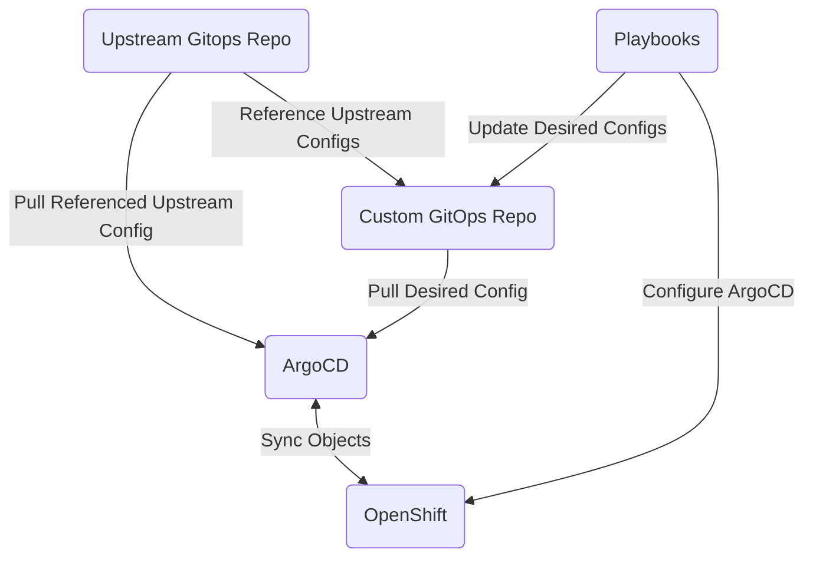

# Index

<!-- vim-markdown-toc GFM -->

* [Architecture](#architecture)
    * [Overview Picture](#overview-picture)
* [Requirements](#requirements)
    * [A Note About Your Bastion Host](#a-note-about-your-bastion-host)
* [Setup](#setup)
    * [Prepare Your Environment](#prepare-your-environment)
        * [Git Repositories](#git-repositories)
* [Components](#components)
* [Running The Playbook](#running-the-playbook)
    * [Running with Different or Updated Credentials](#running-with-different-or-updated-credentials)
    * [Committing Your Changes](#committing-your-changes)
    * [Some Hints](#some-hints)
* [Maintenance Considerations](#maintenance-considerations)
* [A note on reinstalling clusters](#a-note-on-reinstalling-clusters)

<!-- vim-markdown-toc -->

# Architecture

The `openshift_config_gitops.yml` playbook performs the following steps:
- The OpenShift GitOps operator (ArgoCD) is installed on the cluster, and configured
- The Bitnami Sealed Secrets Operator is installed on your cluster
- The Sealing key is downloaded from the Sealed Secrets operator, and stored on your bastion host
- Authentication for your custom Git repository is configured for ArgoCD
- An ApplicationSet is created for ArgoCD, pointing to your custom Git repository
- A checkout of the custom Git repository is filled for you with your desired configurations
- **You** commit and push those changes to the custom Git repository
- ArgoCD syncs and configures everything for you

The configurations in the custom Git repository will oftentimes include a
reference to an upstream. This upstream contains the manifests and
configurations that are typically standard across all clusters. By default this
upstream points to a [public repository owned and maintained by HCS
Company](https://gitlab.com/hcs-company/openshift-gitops-base). It is
recommended that you fork this repository and configure the playbooks to use
your own upstream. That way you can cherry-pick the changes from upstream and
control what you want to deploy.

## Overview Picture

A picture says ~~a thousand~~ exactly 26 words.


# Requirements

Before you can use these playbooks you will need the following:
- A Git repository with SSH access, reachable from the bastion host and the
  OpenShift cluster you wish to configure.
- A bastion host to use which can communicate with both your Git repositories
  as well as your OpenShift cluster. See [A Note About Your Bastion
  Host](#a-note-about-your-bastion-host) for more details.
- Ansible 2.9 or higher

## A Note About Your Bastion Host

If you are using these playbooks to configure your cluster the chances are high
that you also used the `openshift_install.yml` playbook to deploy it. These
playbooks are intended to be used together, and as such will use the same
bastion host. See the installation instructions for requirements on how to
setup and configure your bastion host.

# Setup

## Prepare Your Environment

You will need to prepare a number of things before you can the configuration playbook:

### Git Repositories

You will need one or two Git repositories before you can start, one repository to store the configuration for your cluster, and optionally a second one to store the fork of the [upstream GitOps Base](https://gitlab.com/hcs-company/openshift-gitops-base).

1. Create a new, empty, Git repository on your server/hosting site of choice.
   1. Allow access using an SSH private key.
   2. Store the private key in a file on the bastion host
2. Optionally create a second repository as a fork of [https://gitlab.com/hcs-company/openshift-gitops-base](https://gitlab.com/hcs-company/openshift-gitops-base).
   1. If this is a private repository make sure that it can be accessed by the same SSH key as the previous repository.
3. Configure your inventory according to the options outlined in [the setup_git component guide](docs/components/setup_git.md).

# Components

The `openshift_config_gitops.yml` playbook is controlled by both tags and a
variable called `openshift_components`. The main configuration is the
`openshift_components` variable, detailing exactly which sub-systems should be
configured using ArgoCD. The tags can be used to quickly just run select
components (if configured), or to skip one ore more components. One could for
example use the argument `--tags=apiserver,ingress` to update the certificates
for both the apiserver and the configured Ingresses when they are about to
  expire. Tags for components are identical to their value in `openshift_components`.

**N.B.** The default for `openshift_components` is a list containing **all**
components that can be configured. This is typically not a recommended
configuration for an actual cluster, configure with care.

The following components can be configured in (alphabetical order):

| Component | Description | Documentation |
|-----------|-------------|---------------|
| `allowedregistries` | Container regsitries that are allowed to be used from this cluster  | [Documentation](components/allowedregistries.md) |
| `apiserver` | API Server Certificates and Etcd encryption  | [Documentation](components/apiserver.md) |
| `branding` | Custom Login Screens and Console Branding | [Documentation](components/branding.md) |
| `cicd-operators` | Install OpenShift Pipelines and OpenShift Serverless | [Documentation](components/cicd-operators.md) |
| `cis_compliance` | Configure the cluster to pass the CIS benchmarks | [Documentation](components/cis_compliance.md) |
| `compliance_operator` | Install and configure the OpenShift Compliance Operator and updated TailoredProfiles | [Documentation](components/compliance_operator.md) |
| `console` |  OpenShift Console Configuration | [Documentation](components/console.md) |
| `create_applicationset` | Create ArgoCD ApplicationSet for custom GitOps repo | [Documentation](components/create_applicationset.md) |
| `deploy_gitops` | Deploy and Configure ArgoCD | [Documentation](components/deploy_gitops.md) |
| `groupsync` | Configure per-authentication-provider group synchronization  | [Documentation](components/groupsync.md) |
| `ingress` | Configure Ingress (Router) replicas and certificates | [Documentation](components/ingress.md) |
| `local_storage` | Install and configure local-storage operator, and LocalVolumes | [Documentation](components/local_storage.md) |
| `logging` | Install and configure the OpenShift logging stack | [Documentation](components/logging.md) |
| `machineconfigs` | Create MachineConfigs for Chrony/NTP | [Documentation](components/machineconfigs.md) |
| `metallb` | Configure a MetalLB LoadBalancer| [Documentation](components/metallb.md) |
| `monitoring` | Configure the OpenShift monitoring stack | [Documentation](components/monitoring.md) |
| `network-policies` | Create default NetworkPolicies | [Documentation](components/network-policies.md) |
| `nfs_subdir_provisioner` | Configure the out-of-tree NFS Subdir Provisioner (Do **not** use this one for anything resembling production systems) | [Documentation](components/nfs_subdir_provisioner.md) |
| `nodemaintenanceoperator` | Installs the Node Maintenance Operator, allowing admninistrators to drain and cordon nodes using a CR (OpenShift 4.11+) | [Documentation](components/nodemaintenanceoperator.md) |
| `oauth` | Configure Authentication Providers | [Documentation](components/oauth.md) |
| `odf_storage` | Install and Configure OpenShift Data Foundation (OpenShift 4.9 and higher) | [Documentation](components/odf_storage.md) |
| `proxy` | Configure proxy and trusted CA settings | [Documentation](components/proxy.md) |
| `registry` | Configure the internal registry | [Documentation](components/registry.md) |
| `sealed_secrets` | Install and Configure Bitnami Sealed Secrets Operator | [Documentation](components/sealed_secrets.md) |
| `servicemesh` | Install the necessary operators for Red Hat ServiceMesh | [Documentation](components/servicemesh.md) |
| `setup_git` | Clone/Checkout custom GitOps repository | [Documentation](components/setup_git.md) |
| `trident` | Install and Configure the NetApp™ Trident Operator  | [Documentation](components/trident.md) |

# Running The Playbook

After configuring your Ansible inventory to your desired cluster configuration you can run the playbook as follows:

```bash
ansible-playbook -i <inventory> -e bastion_host=<bastion host> openshift_config_gitops.yml
```

To skip components that would normally be run based on your `openshift_compopnents` variable you can add `--skip-tags=a,b`, where `a` and `b` are the components you wish to skip.

To only run specified components use `--tags=a,b`, where `a` and `b` are the components you wish to run.

## Running with Different or Updated Credentials
If you have already changed certificates on your cluster, or if you did not
install the cluster using the `openshift_install.yml` playbook the earlier
steps of the playbook will fail, since they attempt to communicate with your
cluster using the `kubeconfig` file pointed to by the `openshift_kubeconfig`
variable.

You can add this variable to your inventory in those cases, or you can specify
it on the command line while running the playbook like this:

```bash
ansible-playbook -i <inventory> -e bastion_host=<bastion host> -e openshift_kubeconfig=/path/to/kubeconfig openshift_config_gitops.yml
```

Hint: Your personal `kubeconfig` can be used if you are logged in with admin
credentials by pointing at `.kube/config` in your home directory.

**N.B.** Since all Kubernetes interaction is performed on the `bastion_host`
the `openshift_kubeconfig` file will be used on that machine, **not** your local
Ansible controller if that is a different machine.

## Committing Your Changes

The `openshift_config_gitops.yml` does (by design) not commit anything to Git,
or push changes back to your repository. In most cases you will want to review
the changes, especially on a cluster that had already been running.

The playbook stores the repo on your `bastion_host` under `/opt/openshift_files/<cluster>/gitops`, unless you've changed your `openshift_gitops_dir` variable of course. You can give your regular user access to those files using ACLs (`setfacl`, `getfacl`), or you can commit and push your changes as `root`.

In both cases you will need to make sure that you have an SSH key in your Agent that allows access to the Git repository. An example procedure to this is as follows:

```bash
ssh-agent bash
ssh-add /opt/openshift_files/<cluster>/keys/gitops.rsa
```

After reviewing all changes commit them to git, then push to the repository.


## Some Hints

- You do not typically wish to skip anything on your first run. Most things
  will break if `setup_git` and `sealed_secrets` have not been run at least
  once.
- Because of the nature of Sealed Secrets, anything committed to Git as a
  Sealed Secret will change every single time you run the
  `openshift_config_gitops.yml` playbook. In most cases, where you have not
  updated anything in your inventory touching those secrets, the resulting
  Secret on the cluster will be the same.

# Maintenance Considerations

Because everything is setup as an ApplicationSet, everything gets the same
AutoHeal, Prune, and Retry options in ArgoCD. If you want to make *gasps*
manual changes to an Application or it's assets you will need to edit the
ApplicationSet `cluster-config` in the `openshift-gitops` namespace to remove
all pruning options etc. Before working your way down the stack to the
component you want.

A more automated way of doing this is on the roadmap, but the ETA is as yet undefined.

# A note on reinstalling clusters

If the cluster you are installing already has a git repo with configuration
from a previous deploy you can run into some issues when deploying, namely old
or outdated configurations being applied to the cluster. There are two things
you can do to alleviate this:

1. Empty out the configuration git repository before deploying

Or

2. Run the `openshift_config_gitops.yml` playbook with the option
   `--skip-tags=create_applicationset`. Then when the playbook has finished you
   can go over the resulting gitops directory, check if everything is as you
   want it, commit and push your changes, then run the playbook a second time,
   but this time with the option `--tags=create_applicationset`

